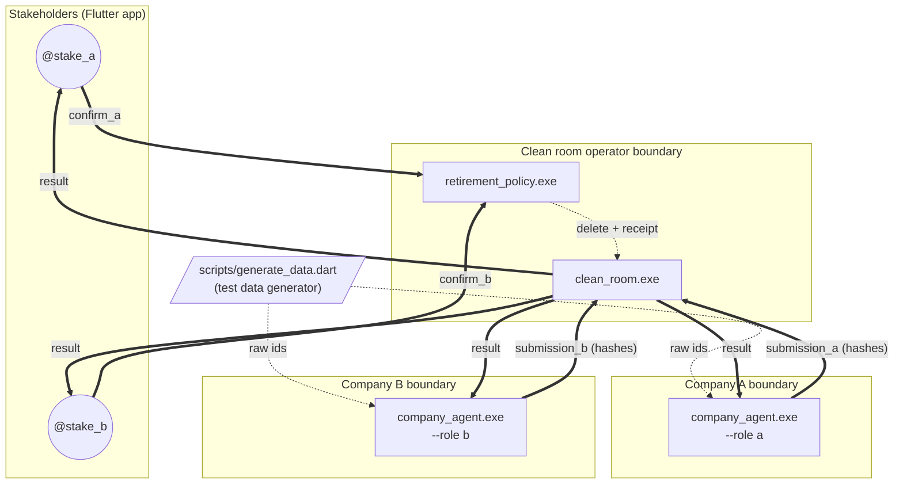
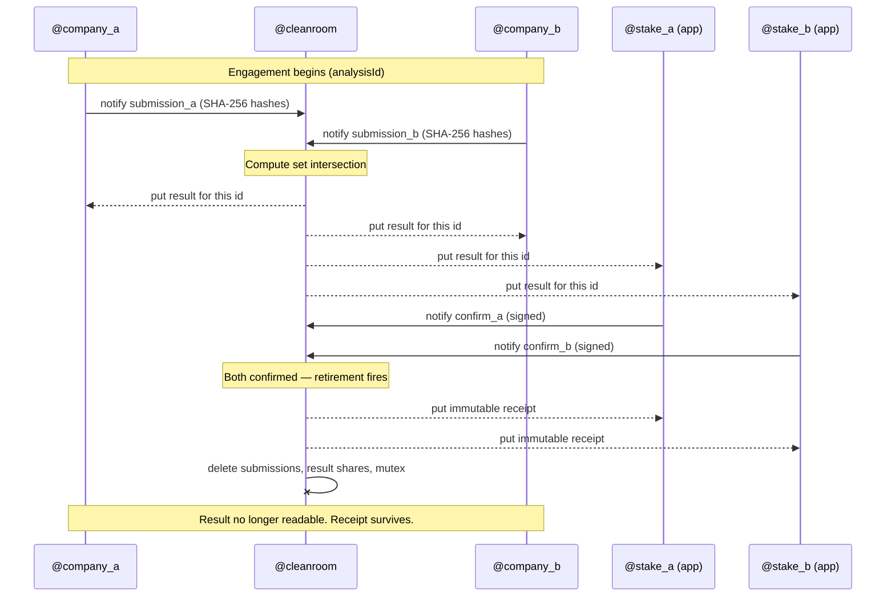
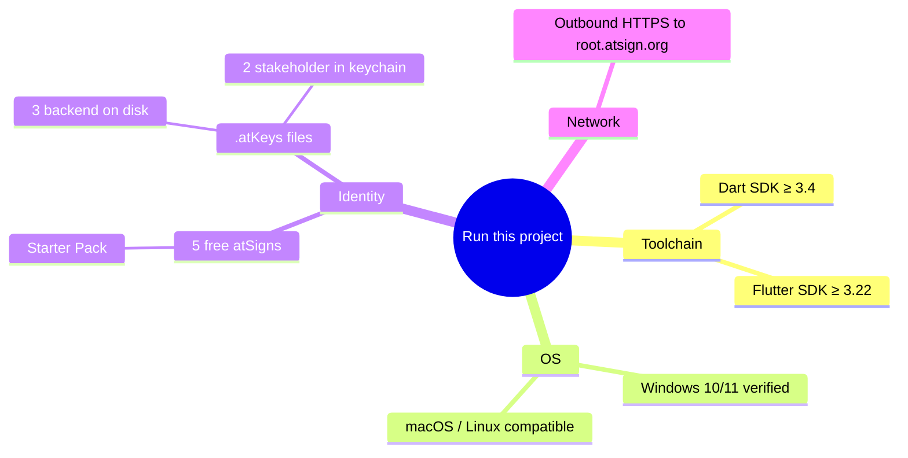
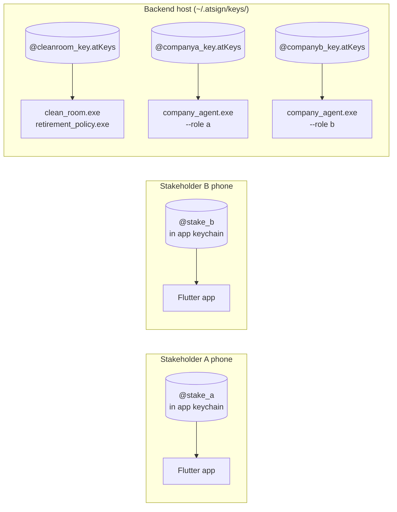
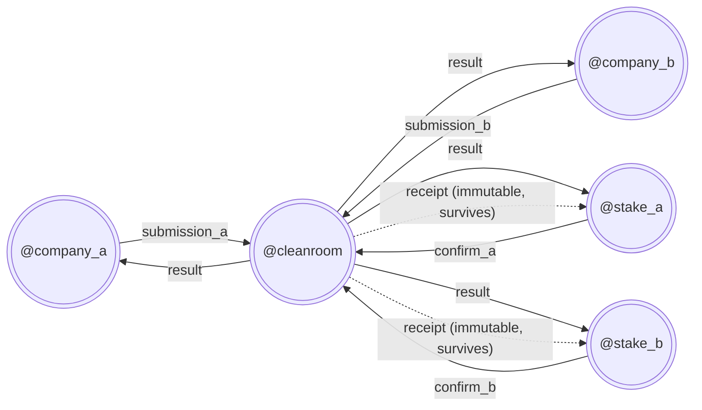
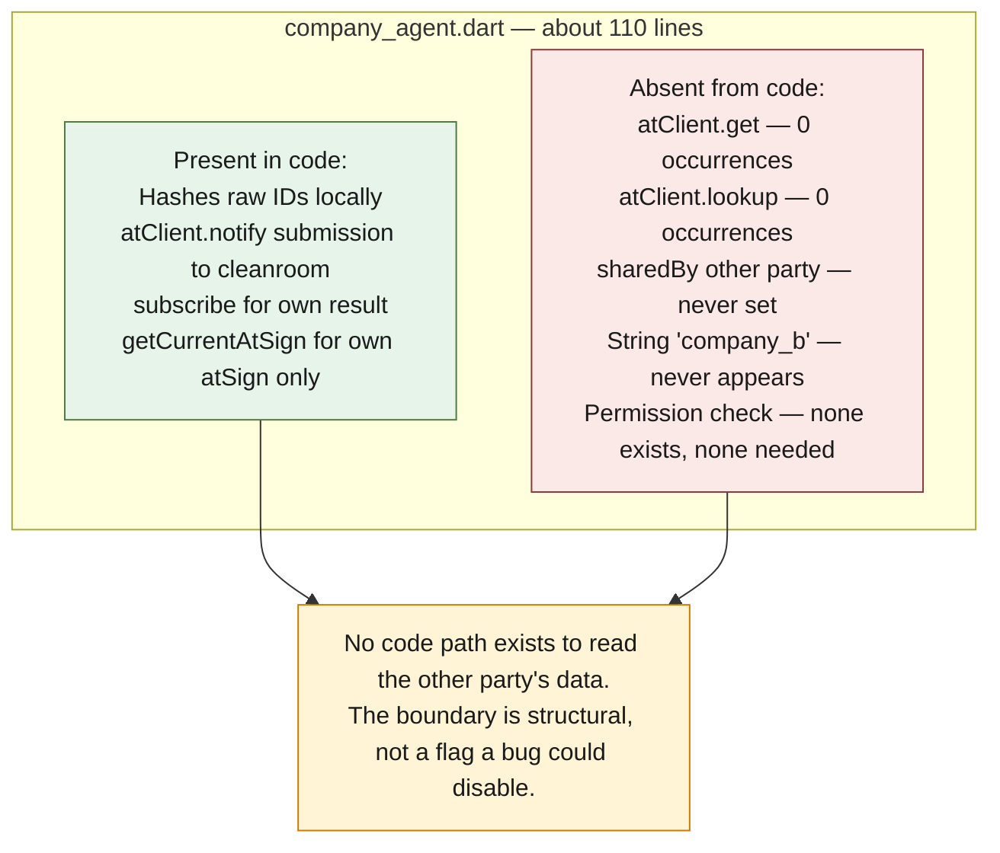
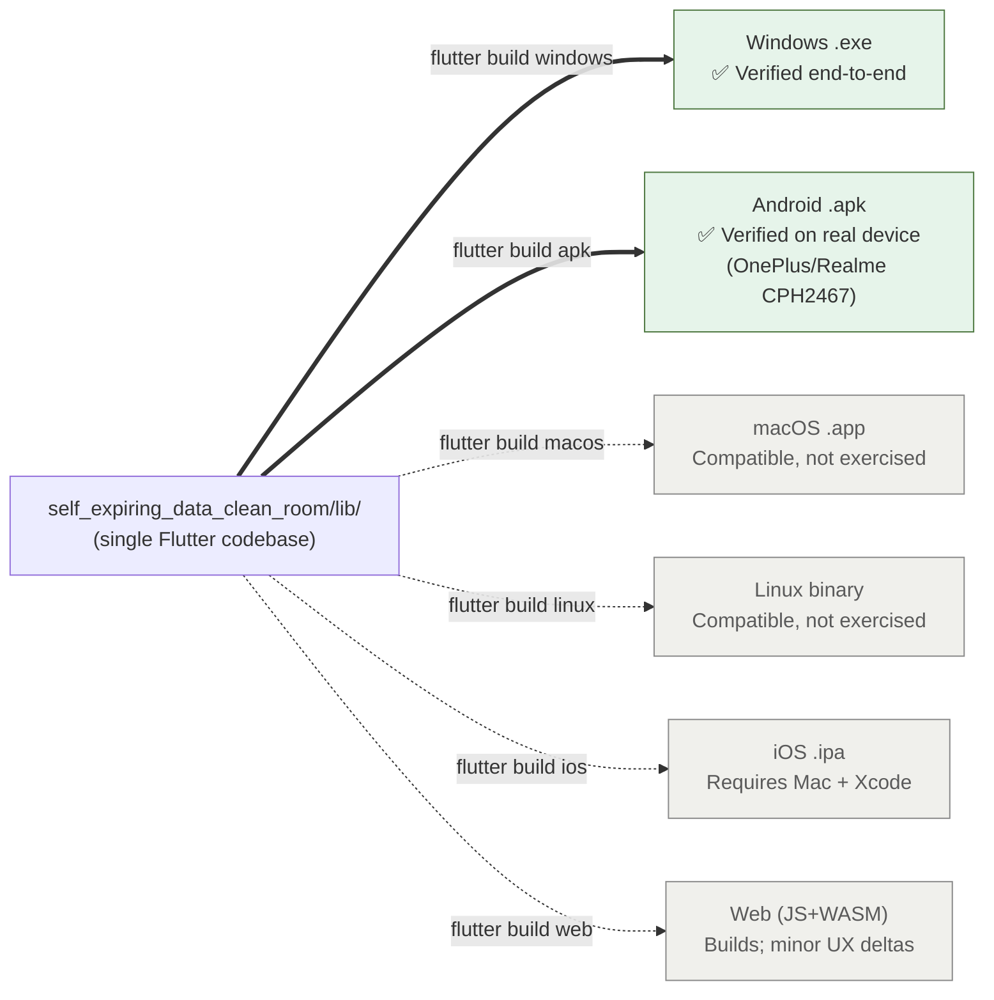

# Self-Expiring Data Clean Room

> A privacy-preserving joint analysis between two companies where **the access keys themselves are destroyed** the moment both sides confirm the analysis is complete. The clean room doesn't get decommissioned — it *stops existing*.

Built for the **Atsign Hackathon 2026** using **Atsign AI Architect (AAIA)** and the Atsign Platform SDK.

## TL;DR

We built a data clean room that **destroys its own cryptographic keys** the moment two companies confirm a joint analysis is complete — so the clean room doesn't get decommissioned, it *stops existing*. The global data clean room market was valued at **$3.2 billion in 2025 and is projected to reach $18.6 billion by 2034** ([MarketIntelo](https://marketintelo.com/report/data-clean-room-market)), and yet nothing in that market treats *"this analysis is done"* as a trigger for *"this access is now cryptographically unrecoverable"* rather than *"unused but technically still there."*

## The Three Facts That Matter Most

**1. The market spends nearly a million dollars to build something supposed to last forever — even when the question being asked is one-time.**

The average company spends as much as **$879,000 setting up a data clean room** ([Kevel, citing a Funnel.io survey](https://www.kevel.com/blog/data-clean-rooms-the-definitive-guide)). That cost only makes sense as an investment in permanence. But most real cross-company questions — a partnership gut-check before lawyers get involved, a one-off audience-overlap study, a due-diligence comparison — are naturally one-time events. The infrastructure and the need are mismatched, and every clean room that outlives its purpose becomes a standing, unmonitored liability — the same category of risk as a forgotten vendor API key nobody revoked.

**2. Existing solutions default to systems that never truly end.**

Every clean room product on the market today (Databricks Clean Rooms, Snowflake Data Clean Rooms, AWS Clean Rooms, Habu, LiveRamp, InfoSum) is built as persistent infrastructure. Even the best-known providers default to systems with no jointly-controlled, key-level teardown — they may offer manual deletion or automated storage-retention timers, but neither party can press a button that destroys the access *cryptographically*. **The retirement event in this project does exactly that, gated on mutual confirmation.**

**3. Our privacy claim is something a judge can verify from the source code, not something we're asking them to trust.**

The entire company-side agent is roughly 110 lines of Dart ([`agents/company_agent/bin/company_agent.dart`](agents/company_agent/bin/company_agent.dart)). It contains **zero `atClient.get()` or `atClient.lookup()` calls.** The string `"company_b"` does not appear anywhere in Company A's binary. There is no permission check to bypass, because **there is no code that would invoke one.**

## The Mechanism, In Plain Language

Each company submits hashed identifiers through a write-only channel — they can put data in, but can never read their own submission back, and have no code path to the other side's data at all. A shared computation returns one aggregate number — an overlap count — which is the only thing either side ever reads out. When both companies' authorized stakeholders confirm the analysis is finished, a retirement event fires, destroying the temporary cryptographic credential that made the exchange readable. An **immutable receipt** survives, documenting what was destroyed and when; the data itself does not.

---

## AAIA: From Blueprint to Code

The architecture was designed in **Atsign AI Architect** before any code was written. The exported blueprint is the single source of truth for the system shape and is submitted separately with the hackathon entry.

The blueprint defines **7 nodes** (2 stakeholders, 2 AI agents, 1 clean-room process, 1 aggregate result store, 1 retirement policy process) and **9 connections** (asynchronous submissions, notifications, RPC kill-switch).

**The implementation follows the blueprint node-for-node:**

| Blueprint node | Implementation |
|---|---|
| Stakeholder A / B (person) | Flutter app user identities |
| Company A / B Agent (aiAgent) | `agents/company_agent/` binary, `--role` switches identity |
| Clean Room Computation (process) | `agents/clean_room_computation/clean_room.dart` |
| Aggregate Result Store (thing) | `result.<id>` AtKey on `@cleanroom`, shared with 4 recipients |
| Retirement Policy (process) | `agents/retirement_policy/retirement_policy.dart` |

This isn't a happy-accident match. The asymmetric write-only / read-aggregate edges and the Retirement Policy's simultaneous control over every key-bearing connection came to exist on the blueprint canvas, then were built. The design and the code share the same diagram.

> For general Atsign SDK patterns (initialization, AtKey construction, multi-agent coordination), see [`ATPLATFORM_GUIDELINES.md`](ATPLATFORM_GUIDELINES.md).

---

## Why This Needs Atsign Specifically

Atsigns are unique, cryptographic identities with non-custodial encryption — every actor (each company, each stakeholder, the clean room itself) holds its own keys, with its own scope of authority. The write-only / aggregate-only boundary in this project isn't a permissions flag in application code that a bug could disable — it's a property of *which identities hold which keys*, full stop. Access for any compromised software node or rogue agent can be revoked instantly at the identity layer, and every data exchange is cryptographically signed.

## Why This Needs AI Architect Specifically

The blueprint canvas is where this system was designed, not documented after the fact. AAIA captures who each participant is, what they're able to do, what authority they have, how they communicate, and which security constraints must be preserved — *before a line of code exists*. Native agent nodes let teams define agent roles, access limits, and interaction patterns as part of the architecture itself, which is exactly how the asymmetric write-only / read-aggregate edges and the Retirement Policy's simultaneous control over every key-bearing connection came to exist: **as the design, not a feature bolted onto a finished app.**

---

## The Honest Limitation

The matching computation uses **salted SHA-256 hashing** to compare identifiers — a simple, real, working version of Private Set Intersection. It is **not** the cryptographically blinded version a production deployment would need; naive hash matching can in principle be probed by a party with a strong guess at the other side's underlying values. We chose to build the correct, simple version and say so plainly, rather than overstate what 24 hours of engineering can deliver. The production path is documented in [Scaling & Production Considerations](#scaling--production-considerations).

## What We Are NOT Claiming

We are not claiming this key material is erased from existence everywhere, including any copy anyone might separately have made — no platform can prove that, and we won't pretend otherwise. What we *can* prove: **the only copies of the session-scoped key ever existed inside the boundary we built.** When that boundary's credential is destroyed, there is nothing left anywhere to decrypt the exchange with, because nothing outside it ever had a copy.

---

## Components

| Component | Kind | atSign role | Lives in |
|---|---|---|---|
| Stakeholder A | Person, uses Flutter app | confirms engagement complete | `self_expiring_data_clean_room/` |
| Stakeholder B | Person, uses Flutter app | confirms engagement complete | `self_expiring_data_clean_room/` |
| Company A Agent | Dart CLI agent | hashes A's identifiers, submits to clean room | `agents/company_agent/` |
| Company B Agent | Dart CLI agent | hashes B's identifiers, submits to clean room | `agents/company_agent/` |
| Clean Room | Dart CLI process | computes overlap on hashed inputs | `agents/clean_room_computation/` |
| Retirement Policy | Dart CLI process (same atSign as clean room) | waits for dual stakeholder confirmation, then deletes keys | `agents/retirement_policy/` |
| Synthetic data generator | Dart script | produces realistic test data with controlled overlap | `scripts/generate_data.dart` |

> The two company agents share the same binary; the role is picked at launch with `--role a` or `--role b`.



## Data Flow



---

## Quick Start (cold clone → first overlap in ~15 min)

### Prerequisites

| Requirement | Version | Where to get |
|---|---|---|
| Dart SDK | ≥ 3.4 | https://dart.dev/get-dart |
| Flutter SDK | ≥ 3.22 | https://flutter.dev/docs/get-started/install |
| OS | Windows 10/11, macOS, or Linux | — |
| 5 atSigns | free Starter Pack | https://my.atsign.com/starterpack_app |



### Step 1 — Clone

```bash
git clone https://github.com/AquibAquil/Self-Expiring-Data-Clean-Room.git
cd Self-Expiring-Data-Clean-Room
```

### Step 2 — Activate 5 atSigns and download their `.atKeys` files

You need 5 atSigns total. The Starter Pack gives you 10+ for free; pick any 5:

| Role | Used by | Needs `.atKeys` on disk? |
|---|---|---|
| Stakeholder A | Flutter app only | ❌ (stays in app keychain) |
| Stakeholder B | Flutter app only | ❌ |
| Clean Room | Backend CLI | ✅ |
| Company A | Backend CLI | ✅ |
| Company B | Backend CLI | ✅ |



The three backend atSigns need `.atKeys` files in `~/.atsign/keys/`. Easiest path:

1. Run the Flutter app first (see Step 3): launch it, tap **Onboard a New Atsign**, enter the atSign, complete the registrar dialog.
2. On the home screen tap **Export Atsign Keys** → save to `~/.atsign/keys/@<atsign>_key.atKeys`.
3. Hot-restart the app (`R` in the Flutter terminal) and repeat for each of the 3 backend atSigns.

(Stakeholder atSigns stay inside the app — no file export needed.)

### Step 3 — Build the Flutter app

```bash
cd self_expiring_data_clean_room
flutter create .                  # scaffolds platform folders if not present
flutter pub get
flutter run -d windows            # or: flutter run -d chrome / -d macos / -d linux
```

### Step 4 — Build the backend agents

From the project root:

```bash
cd agents/clean_room_computation && dart pub get && dart compile exe bin/clean_room.dart -o ../clean_room
cd ../company_agent              && dart pub get && dart compile exe bin/company_agent.dart -o ../company_agent
cd ../retirement_policy          && dart pub get && dart compile exe bin/retirement_policy.dart -o ../retirement_policy
cd ../..
```

On Windows the output files will be `clean_room.exe`, `company_agent.exe`, `retirement_policy.exe`. On Linux/macOS they have no extension.

### Step 5 — Generate test data

```bash
dart scripts/generate_data.dart --a-count 200 --b-count 180 --overlap 47
```

This writes `ids_a.txt` and `ids_b.txt`. The expected overlap (47 of 333 unique = 14.1%) is printed so you can verify the math afterwards.

### Step 6 — Run the engagement

Open **four terminal windows**, all in `agents/`. Replace each `@your_atsign_*` with your real atSigns:

> **PowerShell users:** quote every `@atsign` argument — PowerShell treats `@` as a splat operator on bare tokens. `bash` / `zsh` users don't need the quotes.

**Window 1 — Clean Room** (start first; waits for both submissions):
```powershell
.\clean_room.exe -a "@your_cleanroom" -n cleanroom \
  --analysis-id demo-001 \
  --company-a "@your_companya" --company-b "@your_companyb" \
  --a-stake "@your_stake_a" --b-stake "@your_stake_b"
```

**Window 2 — Retirement Policy** (waits for both stakeholder confirmations):
```powershell
.\retirement_policy.exe -a "@your_cleanroom" -n cleanroom \
  --analysis-id demo-001 \
  --a-stake "@your_stake_a" --b-stake "@your_stake_b" \
  --company-a "@your_companya" --company-b "@your_companyb"
```

**Window 3 — Company A submits:**
```powershell
.\company_agent.exe -a "@your_companya" -n cleanroom \
  --role a --analysis-id demo-001 \
  --peer "@your_cleanroom" \
  --input ..\ids_a.txt
```

**Window 4 — Company B submits:**
```powershell
.\company_agent.exe -a "@your_companyb" -n cleanroom \
  --role b --analysis-id demo-001 \
  --peer "@your_cleanroom" \
  --input ..\ids_b.txt
```

### Step 7 — Watch the lifecycle in the Flutter app

1. Sign in as Stakeholder A (`@your_stake_a`). Enter `demo-001` and `@your_cleanroom`, tap **View Aggregate Result** → green box with overlap count.
2. Tap **Confirm Analysis Complete** (Role: Company A).
3. Hot-restart the app, sign in as Stakeholder B (`@your_stake_b`), confirm as Company B.
4. Window 2 fires retirement: writes the immutable receipt, deletes all engagement keys.
5. Back in the app, tap **View Aggregate Result** again → **red "engagement retired" banner**.
6. Tap **View Retirement Receipt** → **blue audit-trail card** with timestamp, confirmer atSigns, and list of destroyed keys.

That's the full self-expiring lifecycle visible end-to-end.

---

## Notification Keys Reference

All keys are in the `cleanroom` namespace. `<id>` is the per-engagement `analysisId`.

| Key | Owner → Recipient | Purpose | Payload (JSON) |
|---|---|---|---|
| `submission_a.<id>` | `@company_a` → `@cleanroom` | A's hashed identifier set | `{"analysisId":"<id>","hashes":["..."],"hashScheme":"sha256_v1"}` |
| `submission_b.<id>` | `@company_b` → `@cleanroom` | B's hashed identifier set | same shape |
| `result.<id>` | `@cleanroom` → `@company_a`, `@company_b`, `@stake_a`, `@stake_b` (4 shares) | Aggregate output | `{"analysisId":"<id>","overlapCount":N,"overlapPercent":P,"aSize":N,"bSize":M}` |
| `confirm_a.<id>` | `@stake_a` → `@cleanroom` | Stakeholder A confirms complete | `{"analysisId":"<id>","at":"<iso8601>"}` |
| `confirm_b.<id>` | `@stake_b` → `@cleanroom` | Stakeholder B confirms complete | same shape |
| `mutex.<id>` | `@cleanroom` (immutable, 1h TTL) | Multi-instance lock | `{"holder":"<pid>"}` |
| `receipt.<id>` | `@cleanroom` → `@stake_a`, `@stake_b` (immutable, **survives retirement**) | Audit trail | `{"analysisId","retiredAt","confirmedBy":[...],"destroyedKeys":[...],"cleanRoom"}` |

> When retirement fires, the Retirement Policy `delete()`s `submission_a.<id>`, `submission_b.<id>`, all four `result.<id>` shares, and `mutex.<id>`. It does NOT delete `receipt.<id>` — that's the deliberate audit trail.



> Arrow direction = "owned by source, shared with target." Solid edges represent keys destroyed at retirement. Dotted edges are the immutable receipt — the only thing that survives.

---

## Static Code Proof of Inter-Company Isolation

A judge can verify this claim **from the source code, not from runtime behavior**:

> *Company A's agent has no code path that lets it read Company B's submission. The privacy guarantee is not "the platform checks permissions" — it is "the function literally does not exist."*

The entire company-side binary is [`agents/company_agent/bin/company_agent.dart`](agents/company_agent/bin/company_agent.dart) (~110 lines including comments and CLI arg parsing). Search the file:

| What to grep for | Hits in `company_agent.dart` | What it means |
|---|---|---|
| `atClient.get(` or `atClient.lookup(` | 0 hits. Only `atClient.getCurrentAtSign()` (returns own atSign string) | No read code path exists. |
| `sharedBy` | 1 hit, set to `me` (= the agent's own atSign) | Every key the agent constructs is owned by itself. |
| `sharedWith` | 1 hit, set to `peer` (= the clean room atSign, passed via `--peer` flag) | Only recipient ever named is the clean room. |
| Literal string `"company_b"` or `"_b."` | 0 hits | The agent has no awareness of the other company's atSign. |

There is no permission check to bypass because there is no code that would invoke one. This is verifiable with `grep -nE 'get\(|lookup\(|sharedBy|sharedWith|company_b' agents/company_agent/bin/company_agent.dart`.



---

## Scaling & Production Considerations

This hackathon build implements the simplest version of the architecture that demonstrates the full self-expiring lifecycle. The following are the known scaling gaps, what would change, and what would not.

**More than two parties.** The current code special-cases A and B via `--company-a` / `--company-b` flags. Generalizing to N parties is mechanical: replace those two with `--participants @c1,@c2,...,@cN` and have the clean room wait for N submissions before computing the intersection. No protocol redesign required.

**Hash-based set intersection.** This build uses SHA-256 with a per-engagement salt over each party's identifiers. This defeats casual offline tampering but is vulnerable to dictionary attacks against low-entropy inputs (emails, phone numbers) by a curious clean-room operator. For production we would replace it with a Private Set Intersection (PSI) protocol such as ECDH-PSI or OPRF-based PSI, run directly between company agents over **NoPorts** tunnels (Atsign's E2E-encrypted TCP module). The clean room would no longer see hashes at all — only an encrypted overlap count.

**Dataset size.** Set intersection over hashes is O(N+M) and runs comfortably for datasets in the millions of records on commodity hardware. The current binary holds the full submission in memory; production would stream from disk and batch the intersection.

**Concurrent engagements per clean room.** The mutex pattern is keyed by `analysisId`, so a single clean-room atSign can host unlimited concurrent engagements as long as analysis IDs are distinct. The mutex is immutable with a 1-hour TTL; a stale mutex from a crashed run blocks reuse of that exact analysis ID for an hour.

**Clean-room operator trustworthiness.** In this design the clean room sees both parties' hashed inputs and the final result. A malicious operator could correlate hashes across multiple engagements run by the same parties. Production deployments would either (a) use a different per-engagement clean-room atSign per analysis (cryptographic isolation between engagements), or (b) move to a fully blinded PSI protocol where the clean room sees nothing but encrypted intermediates.

**Retirement durability.** Retirement deletes data the clean-room operator has access to. It cannot retract data already read by either company before retirement fired — by design, the companies have legitimate access to their share of the result. The receipt is the audit trail that documents what was retired and when; it does not retract the result from the companies who saw it.

**Hosted / multi-tenant deployment.** Each participant runs their own agent. A SaaS-style central host is intentionally not in scope — it would contradict the "no application backend" property that makes the self-expiring guarantee meaningful. Production deployments should host each participant's agent on infrastructure that participant controls (their own VPC, their own cloud account).

---

## Known Limitations

- **Hash-based PSI** is the privacy floor described above. Sufficient for high-entropy identifiers (UUIDs, hashed account IDs from a CRM); weak for emails or phone numbers. Production fix: PSI over NoPorts.
- **Mutex `force` delete is not yet implemented** — the immutable mutex with TTL is overzealous on cleanup. If you re-run with the same `analysisId` within 1 hour and the previous run crashed, you'll see `another instance holds mutex.<id> — exiting`. Workaround: use a fresh analysisId or wait an hour.
- **Tested on Windows.** Flutter and Dart are cross-platform; macOS / Linux / web should work out of the box but haven't been exercised end-to-end at submission time.
- **Single clean-room operator.** Multi-operator scenarios (each engagement uses a different clean-room atSign for cryptographic isolation between engagements) is documented as a production path but not implemented in this build.

---

## Platforms

| Target | Status |
|---|---|
| Windows desktop (`flutter build windows`) | ✅ Verified end-to-end |
| Android (`flutter build apk`) | ✅ **Verified on real device** (OnePlus/Realme CPH2467) — same atSign identity, same atServer, simultaneous truth across both devices |
| macOS / Linux desktop | Inherent to Flutter; not exercised at submission time |
| iOS | Inherent to Flutter; requires macOS + Xcode, not exercised at submission time |
| Web (`flutter build web`) | Inherent to Flutter; the `Export Atsign Keys` flow on web renders as a browser download rather than a native save dialog |

**Cross-platform note:** the Flutter codebase is one source tree compiling to one native binary per target — no platform-specific code branches. The same `lib/` directory drives the Windows `.exe` and the Android `.apk`.



---

## Design System

The stakeholder app was designed in Figma before being implemented in Flutter. Both the design intent and the implementation share a small, deliberate component library:

| Component | Purpose |
|---|---|
| `IdentityCard` | Top-of-screen identity: friendly name primary, atSign secondary (monospace), role chip |
| `LifecycleStatusChip` | Always-visible engagement state — active (green), awaiting (amber), retired (red); paired icon + text, never color alone |
| `SectionCard` | Header (icon + title + optional subtitle) + body wrapper used by every major section |
| `Donut` | Hand-coded `CustomPaint` chart for overlap-percentage visualization |
| `appToast(...)` | Branded SnackBar with `success` / `error` / `info` variants; error variant supports a `RETRY` action |
| `showConfirmDialog(...)` | Modal for irreversible actions ("Confirm Analysis Complete") with explicit "cannot be undone" copy |

**Brand direction:** muted enterprise palette (deep teal `#0F4C5C` primary, off-white surface, semantic state colors). Typography is Inter for body and JetBrains Mono for cryptographic identifiers — the monospace font visually separates "this is a key, not human prose."

**UX principles enforced:**
- State is always visible (lifecycle chip is at the top of the screen, not behind a tap)
- Color is always paired with an icon and a text label (accessible to colorblind users)
- Cryptographic identifiers (atSigns, key names) are never the primary visual label — friendly names take that role
- Irreversible actions go through a confirmation dialog
- All errors translated to user language with retry where applicable

---

## Project Structure

```
clean_room_atsign/
├── agents/
│   ├── clean_room_computation/    # Dart CLI: set-intersection over hashed inputs
│   ├── company_agent/             # Dart CLI: hash-and-submit, single binary for A and B
│   └── retirement_policy/         # Dart CLI: dual-confirmation listener, writes receipt, deletes keys
├── scripts/
│   └── generate_data.dart         # Synthetic email generator with controlled overlap
├── self_expiring_data_clean_room/ # Flutter app (stakeholder UI)
│   └── lib/
│       ├── main.dart              # App bootstrap; loads custom theme
│       ├── theme.dart             # Brand color palette + Material 3 theme
│       ├── gate_screen.dart       # Mandatory first-run Atsign gate
│       ├── welcome_screen.dart    # Four-workflow auth (Keychain, Registrar, APKAM, .atKeys)
│       ├── home_screen.dart       # Confirm, View Result, View Receipt, Export Keys
│       └── widgets/               # Reusable design-system components
│           ├── identity_card.dart       # Friendly-name + atSign + role badge
│           ├── lifecycle_chip.dart      # Engagement state pill (active/awaiting/retired)
│           ├── section_card.dart        # Header + body wrapper for each section
│           ├── donut.dart               # Overlap-percent donut chart
│           ├── app_toast.dart           # Branded SnackBar variants (success/error/info)
│           └── confirm_dialog.dart      # Irreversible-action confirmation modal
├── ATPLATFORM_GUIDELINES.md       # Atsign SDK reference
└── README.md                      # This file
```

---

## Tech Stack

- **Atsign Platform SDK** — [`at_client`](https://pub.dev/packages/at_client) ^3.11, [`at_client_flutter`](https://pub.dev/packages/at_client_flutter) ^1.1, [`at_cli_commons`](https://pub.dev/packages/at_cli_commons), [`at_auth`](https://pub.dev/packages/at_auth), [`at_commons`](https://pub.dev/packages/at_commons)
- **Dart** ≥ 3.4 (CLI agents compiled to native single-binary executables via `dart compile exe`)
- **Flutter** ≥ 3.22 (Material 3, custom theme)
- **UI** — [`google_fonts`](https://pub.dev/packages/google_fonts) (Inter + JetBrains Mono), custom design system, hand-coded donut chart
- **Auth helpers** — [`file_picker`](https://pub.dev/packages/file_picker) ^11 (cross-platform), [`url_launcher`](https://pub.dev/packages/url_launcher), [`path_provider`](https://pub.dev/packages/path_provider)
- **Crypto** — [`crypto`](https://pub.dev/packages/crypto) (SHA-256 for hashed identifier submissions)
- **Atsign AI Architect** — used for the source-of-truth blueprint that defined the node-and-edge structure of the system before any code was written.

---

## License

Licensed under the MIT License — see [LICENSE](LICENSE).

---

## Acknowledgements

- **Atsign Foundation** for the platform and the AI Architect tool.
- Synthetic test data generated by [`scripts/generate_data.dart`](scripts/generate_data.dart). No real personal data is shipped in this repository.
